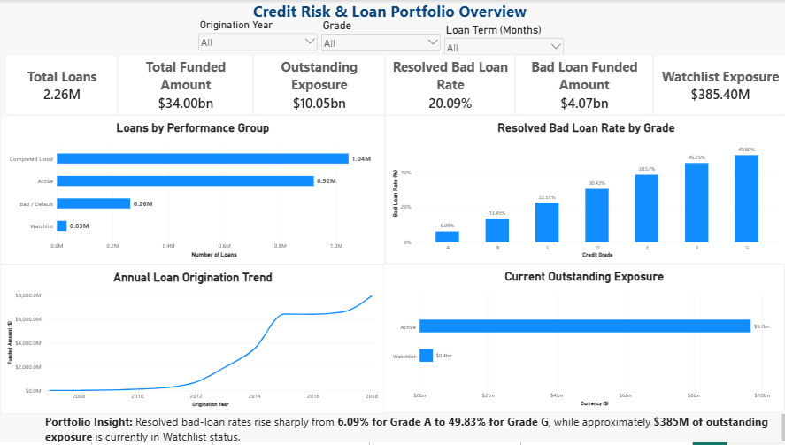
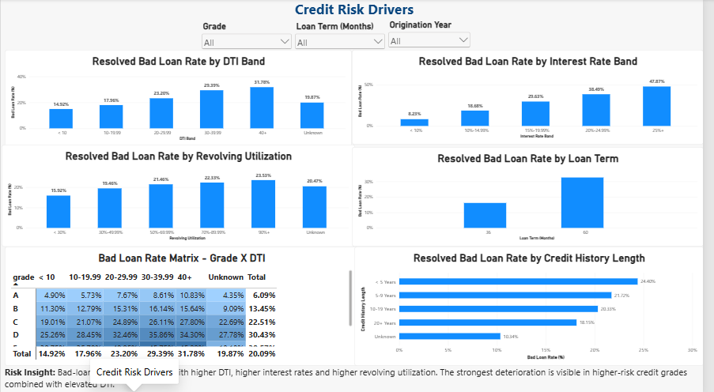
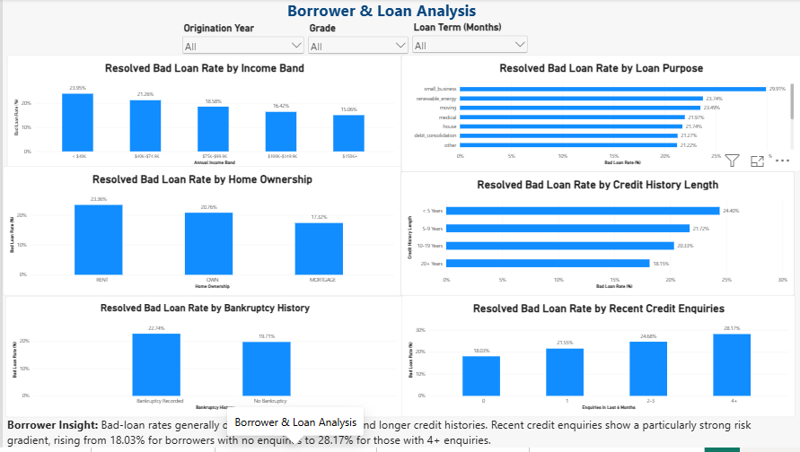
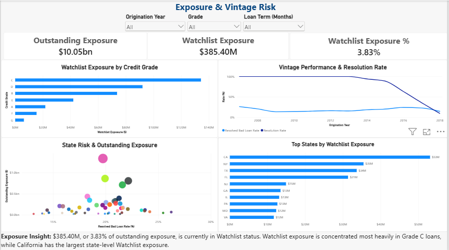
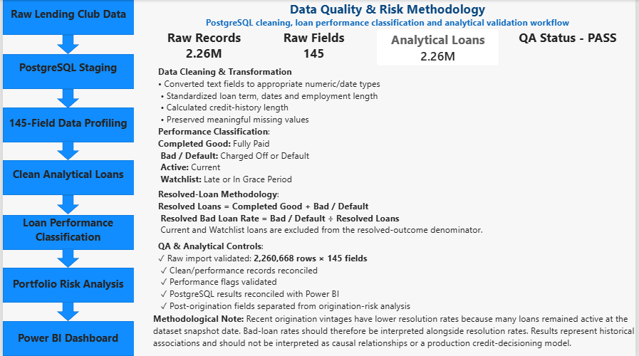

# Credit Risk & Loan Portfolio Analysis

## Project Overview

This project presents an end-to-end **Credit Risk and Loan Portfolio Analysis** using **PostgreSQL and Microsoft Power BI**.

The project analyses approximately **2.26 million Lending Club loan records across 145 source fields** to understand historical loan performance, identify characteristics associated with higher credit risk, and monitor current portfolio exposure.

PostgreSQL was used for data staging, profiling, cleaning, transformation, loan-performance classification and quality validation. Power BI was used to create an interactive five-page dashboard for portfolio and credit-risk analysis.

The final analysis covers:

- Portfolio performance
- Credit-risk drivers
- Borrower characteristics
- Loan characteristics
- Outstanding exposure
- Watchlist exposure
- Geographic concentration
- Vintage performance
- Data quality and methodology

---

## Business Problem

A loan portfolio contains loans at different stages of their lifecycle.

Some loans have reached a final outcome, such as **Fully Paid, Charged Off or Default**, while others remain **Current, Late or In Grace Period**.

Treating all non-defaulted loans as successful would therefore produce misleading credit-risk results because many active loans have not yet reached a final outcome.

This project was designed to answer the following business questions:

1. What is the overall size and performance of the loan portfolio?
2. What proportion of resolved loans resulted in bad/default outcomes?
3. Which credit characteristics are associated with higher bad-loan rates?
4. How does risk vary by credit grade, DTI, interest rate and loan term?
5. Which borrower characteristics are associated with higher historical risk?
6. Where is current Watchlist exposure concentrated?
7. How does loan performance vary across origination vintages?
8. How should recent vintages be interpreted when many loans remain unresolved?

The analysis therefore separates:

**Historical Credit Outcome Risk**

from

**Current Portfolio Exposure Risk**

---

## Dataset

The project uses the **Lending Club Accepted Loan Dataset**.

### Dataset Summary

- **Raw records:** 2,260,668
- **Raw fields:** 145
- **Coverage:** Historical loan data through 2018
- **Data level:** Individual loan records

The dataset contains information including:

- Loan amount
- Funded amount
- Loan term
- Interest rate
- Credit grade and sub-grade
- Employment history
- Annual income
- Home ownership
- Loan purpose
- Debt-to-income ratio
- Credit enquiries
- Delinquency history
- Revolving credit utilisation
- Bankruptcy history
- Tax liens
- Credit-history information
- Geography
- Loan status
- Outstanding principal
- Payments
- Recoveries
- Hardship information
- Debt settlement information

The original large source CSV is not included in this repository because of its file size.

---

## Tools Used

- **PostgreSQL** — database staging, cleaning, transformation and analysis
- **pgAdmin 4** — PostgreSQL database management and SQL development
- **SQL** — profiling, cleaning, classification, aggregation and validation
- **Microsoft Power BI** — interactive dashboard development
- **DAX** — dynamic portfolio and risk measures
- **Power Query** — data preparation and type validation
- **GitHub** — project documentation and portfolio presentation

---

## Data Cleaning

The raw dataset was first loaded into PostgreSQL using a staging-table approach.

The complete **145-field source structure** was initially preserved before analytical transformations were applied.

The main cleaning and transformation activities included:

- Profiling missing values across all source fields
- Checking field sparsity
- Validating numeric formats
- Validating date formats
- Converting financial fields from text to numeric data types
- Converting month-year fields into PostgreSQL dates
- Standardising loan terms into 36 and 60 months
- Converting employment length into a numerical analytical field
- Standardising credit grade, sub-grade and state values
- Calculating credit-history length
- Preserving meaningful missing values instead of automatically replacing them
- Separating origination-time information from post-origination performance information

The main PostgreSQL layers created were:

- `staging.lending_club_raw`
- `staging.lending_club_column_profile`
- `analytics.loans_clean`
- `analytics.loan_performance`
- `analytics.resolved_loans`
- `analytics.powerbi_loan_fact`

---

## Credit Risk Methodology

A key methodological decision in this project was to distinguish loans with **final outcomes** from loans that were still active.

### Resolved Loans

Resolved loans were defined as:

**Resolved Loans = Completed Good + Bad / Default**

### Resolved Bad Loan Rate

The primary historical credit-risk KPI was calculated as:

**Resolved Bad Loan Rate = Bad / Default Loans ÷ Resolved Loans**

Current and Watchlist loans were excluded from this denominator because they had not yet reached a terminal outcome.

This prevents Current loans from incorrectly being treated as successfully repaid loans.

Historical outcome analysis was therefore separated from current portfolio exposure analysis.

---

## Loan Performance Classification

Loans were classified into four main performance groups.

### Completed Good

Includes:

- Fully Paid
- Does not meet the credit policy – Fully Paid

### Bad / Default

Includes:

- Charged Off
- Default
- Does not meet the credit policy – Charged Off

### Active

Includes:

- Current

### Watchlist

Includes:

- Late (16–30 days)
- Late (31–120 days)
- In Grace Period

Unexpected statuses were retained as **Other / Review** instead of being automatically classified.

Additional analytical flags were created for:

- Resolved loans
- Completed Good loans
- Bad loans
- Active loans
- Watchlist loans

---

## Risk Segmentation

Several analytical bands were created to make portfolio-risk comparisons easier.

### DTI Bands

- < 10
- 10–19.99
- 20–29.99
- 30–39.99
- 40+

### Interest Rate Bands

- < 10%
- 10–14.99%
- 15–19.99%
- 20–24.99%
- 25%+

### Annual Income Bands

- < $40K
- $40K–$74.9K
- $75K–$99.9K
- $100K–$149.9K
- $150K+

### Revolving Utilisation Bands

- < 30%
- 30–49.99%
- 50–69.99%
- 70–89.99%
- 90%+

### Credit History Bands

- < 5 Years
- 5–9 Years
- 10–19 Years
- 20+ Years

### Recent Credit Enquiries

- 0
- 1
- 2–3
- 4+

These categories were created for analytical comparison and are not official Lending Club or regulatory risk classifications.

---

## Power BI Dashboard

The final Power BI dashboard contains **five pages**.

### Page 1 — Portfolio Overview

Provides an executive view of portfolio size, historical performance and current exposure.

Key portfolio metrics:

- **2.26M Total Loans**
- **$34.00B Total Funded Amount**
- **$10.05B Outstanding Exposure**
- **20.09% Resolved Bad Loan Rate**
- **$4.07B Bad Loan Funded Amount**
- **$385.40M Watchlist Exposure**

Main visuals include:

- Loans by Performance Group
- Resolved Bad Loan Rate by Grade
- Annual Loan Origination Trend
- Current Outstanding Exposure



---

### Page 2 — Credit Risk Drivers

Examines major loan and credit characteristics associated with historical bad-loan outcomes.

The page analyses:

- Debt-to-Income Ratio
- Interest Rate
- Revolving Utilisation
- Loan Term
- Credit Grade × DTI
- Credit History Length



---

### Page 3 — Borrower & Loan Analysis

Examines borrower characteristics and loan-purpose differences.

The page analyses:

- Income Band
- Loan Purpose
- Home Ownership
- Credit History Length
- Bankruptcy History
- Recent Credit Enquiries



---

### Page 4 — Exposure & Vintage Risk

Focuses on current portfolio exposure and origination-vintage performance.

Key metrics include:

- **$10.05B Outstanding Exposure**
- **$385.40M Watchlist Exposure**
- **3.83% Watchlist Exposure**

The page includes:

- Watchlist Exposure by Credit Grade
- Vintage Performance
- Vintage Resolution Rate
- State Risk vs Outstanding Exposure
- Top States by Watchlist Exposure



---

### Page 5 — Data Quality & Methodology

Documents the complete analytical workflow:

Raw Lending Club Data  
↓  
PostgreSQL Staging  
↓  
145-Field Data Profiling  
↓  
Clean Analytical Loans  
↓  
Loan Performance Classification  
↓  
Portfolio Risk Analysis  
↓  
Power BI Dashboard

The page also documents data-cleaning rules, performance classification, resolved-loan methodology and quality-assurance controls.



---

## Key Findings

### 1. Credit Grade Strongly Differentiated Risk

Resolved bad-loan rates increased substantially as credit grade weakened.

| Credit Grade | Resolved Bad Loan Rate |
|---|---:|
| A | 6.09% |
| B | 13.45% |
| C | 22.51% |
| D | 30.43% |
| E | 38.57% |
| F | 45.25% |
| G | ~49.8% |

This represents one of the clearest risk gradients identified in the portfolio.

---

### 2. Higher DTI Was Associated with Higher Bad-Loan Rates

| DTI Band | Bad Loan Rate |
|---|---:|
| < 10 | 14.92% |
| 10–19.99 | 17.96% |
| 20–29.99 | 23.20% |
| 30–39.99 | 29.39% |
| 40+ | 31.78% |

Observed loan performance deteriorated progressively as borrower debt burden increased.

---

### 3. Interest Rate Showed a Strong Risk Gradient

| Interest Rate | Bad Loan Rate |
|---|---:|
| < 10% | 8.23% |
| 10–14.99% | 18.68% |
| 15–19.99% | 29.63% |
| 20–24.99% | 38.49% |
| 25%+ | 47.87% |

Higher-priced loans were strongly associated with poorer historical outcomes.

---

### 4. Revolving Utilisation Was Associated with Higher Risk

Bad-loan rates increased from approximately **15.92% for borrowers with less than 30% revolving utilisation** to approximately **23.53% for borrowers with utilisation of 90% or more**.

---

### 5. Higher Income Was Associated with Lower Historical Risk

| Annual Income | Bad Loan Rate |
|---|---:|
| < $40K | 23.95% |
| $40K–$74.9K | 21.26% |
| $75K–$99.9K | 18.58% |
| $100K–$149.9K | 16.42% |
| $150K+ | 15.06% |

The portfolio showed a clear decline in observed bad-loan rates as borrower income increased.

---

### 6. Recent Credit Enquiries Were a Strong Risk Indicator

| Enquiries in Last 6 Months | Bad Loan Rate |
|---|---:|
| 0 | 18.03% |
| 1 | 21.55% |
| 2–3 | 24.68% |
| 4+ | 28.17% |

Borrowers with four or more recent enquiries showed materially higher observed bad-loan rates than borrowers with no recent enquiries.

---

### 7. Longer Credit Histories Were Associated with Better Outcomes

| Credit History | Bad Loan Rate |
|---|---:|
| < 5 Years | 24.40% |
| 5–9 Years | 21.72% |
| 10–19 Years | 20.33% |
| 20+ Years | 18.15% |

---

### 8. Bankruptcy History Differentiated Risk

Borrowers with recorded bankruptcy history showed a higher observed bad-loan rate:

- **Bankruptcy Recorded:** 22.74%
- **No Bankruptcy:** 19.71%

---

### 9. Home Ownership Showed Different Risk Profiles

Observed bad-loan rates were approximately:

- **RENT:** 23.98%
- **OWN:** 20.76%
- **MORTGAGE:** 17.32%

Mortgage borrowers showed lower historical bad-loan rates than renters within this portfolio.

---

### 10. Watchlist Exposure Remained Material

The portfolio contained approximately **$385.40M of Watchlist outstanding exposure**, representing **3.83% of total outstanding exposure**.

Watchlist exposure was most heavily concentrated in **Grade C loans**.

California represented the largest state-level Watchlist exposure in the dashboard.

---

## Business Recommendations

Based on the analysis, the following portfolio-management actions are suggested:

1. **Prioritise monitoring of lower credit grades**, particularly E–G, where historical bad-loan rates are significantly higher.

2. **Strengthen monitoring of high-DTI borrowers**, particularly when high DTI is combined with weaker credit grades.

3. **Use multiple risk indicators together** rather than relying on a single borrower characteristic. Important indicators include grade, DTI, revolving utilisation, recent enquiries and credit-history length.

4. **Closely monitor borrowers with multiple recent credit enquiries**, as observed bad-loan rates increase progressively with enquiry frequency.

5. **Monitor Watchlist exposure in both percentage and dollar terms**, because portfolio significance depends on exposure size as well as historical risk.

6. **Prioritise Grade C Watchlist exposure**, as this grade currently represents the largest concentration of Watchlist outstanding exposure.

7. **Monitor geographic exposure concentration**, particularly states with both large outstanding balances and significant Watchlist exposure.

8. **Interpret recent vintages together with resolution rates**, because many recent loans have not yet reached a final outcome.

9. **Keep origination-risk data separate from post-origination performance information** if the project is later extended into predictive modelling.

---

## Data Quality Validation

Data-quality checks were performed throughout the PostgreSQL and Power BI workflow.

Key validation controls included:

- Raw import reconciled to **2,260,668 records**
- Source structure confirmed at **145 fields**
- Column-level data profiling completed
- Missing values reviewed
- Numeric formats validated
- Date formats validated
- Clean and performance records reconciled
- Loan-level surrogate keys checked for uniqueness
- Performance flags validated
- Conflicting loan classifications checked
- Resolved-loan calculations reconciled
- Risk-summary outputs reconciled
- PostgreSQL totals reconciled with Power BI

Final methodology dashboard status:

| Validation Item | Result |
|---|---:|
| Raw Records | 2.26M |
| Raw Fields | 145 |
| Analytical Loans | 2.26M |
| QA Status | PASS |

### Important Methodological Note

Recent origination vintages have lower resolution rates because many loans were still active at the dataset snapshot date.

Bad-loan rates for recent vintages should therefore be interpreted alongside their resolution rates.

The results in this project describe **historical associations** and should not be interpreted as causal relationships or as a production credit-decisioning model.

---

## Repository Structure

The planned repository structure is:

```text
credit-risk-loan-portfolio-analysis/
│
├── powerbi/
│   └── README.md
│
├── screenshots/
│   ├── 01_Portfolio_Overview.png
│   ├── 02_Credit_Risk_Drivers.png
│   ├── 03_Borrower_Loan_Analysis.png
│   ├── 04_Exposure_Vintage_Risk.png
│   ├── 05_Data_Quality_Methodology.png
│   └── README.md
│
├── sql/
│   ├── 01_Database_and_Staging_Design.sql
│   ├── 02_Lending_Club_145_Column_Profile.sql
│   ├── 03_Build_Loans_Clean.sql
│   ├── 04_Loan_Performance.sql
│   ├── 05_Portfolio_Risk_Analysis.sql
│   ├── 06_PowerBI_Preparation.sql
│   └── README.md
│
└── README.md
```

Power BI file note: The .pbix development file is approximately 128 MB and is retained locally due to GitHub file-size limitations. Final dashboard outputs are available in the screenshots/ folder.
